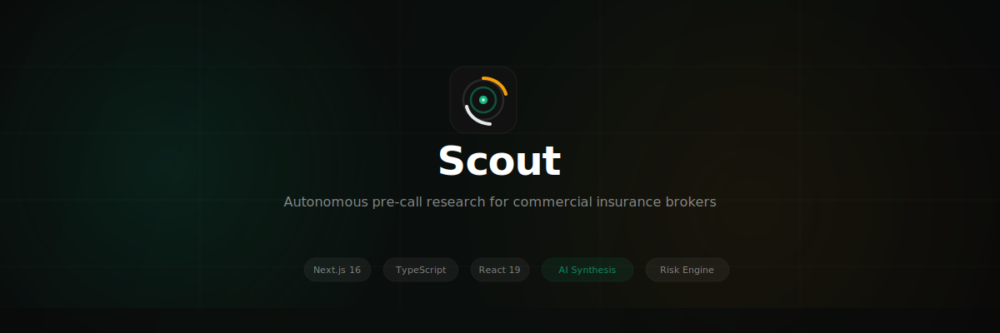
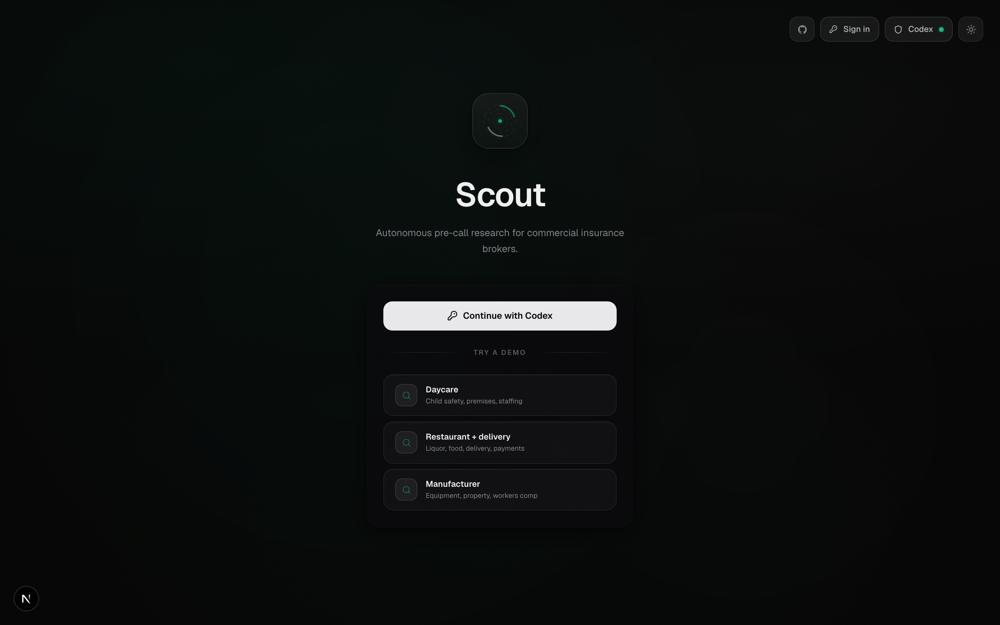
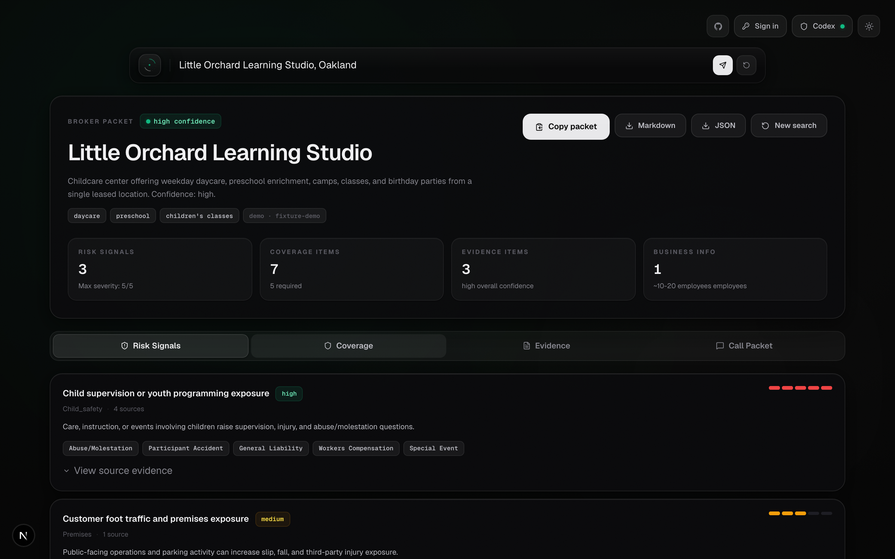
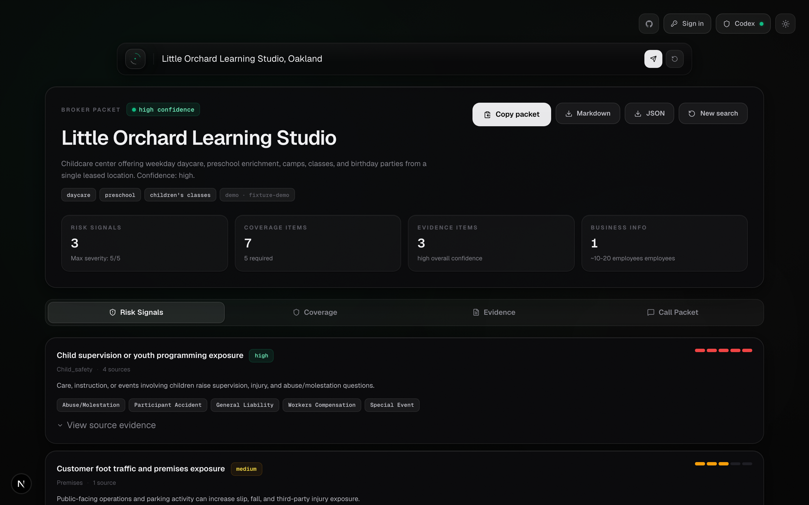
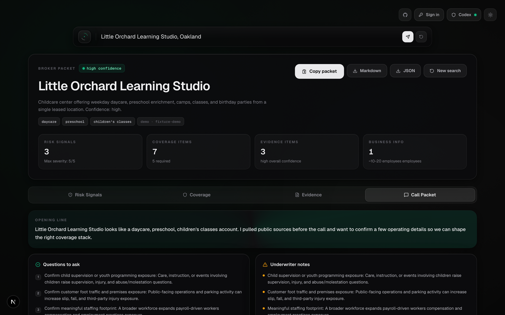
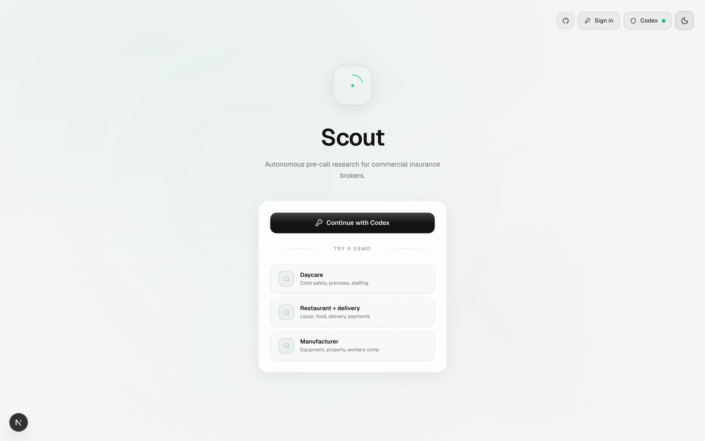

<div align="center">



<br />

[](https://typescriptlang.org)
[](https://nextjs.org)
[](https://react.dev)
[](LICENSE)

**Enter a business name. Get a broker-ready research packet with risk signals, coverage recommendations, and call prep — in seconds.**

[Try the demo](#quick-start) · [Architecture](#architecture) · [How it works](#how-it-works)

</div>

---

## The Problem

Commercial insurance brokerage starts with incomplete information. Before the first call, a producer needs to build an underwriting picture: premises exposure, delivery operations, staffing footprint, liquor liability, cyber risk, flood zones, property hazards, and the questions that will matter on the call.

Today, this prep work is manual — brokers spend 30-60 minutes researching each prospect across multiple sources, building notes, and figuring out what to ask. For a brokerage adding 1,000+ customers per month, that doesn't scale.

## What Scout Does

Scout is an autonomous research agent that compresses broker pre-call prep into a single run. Enter a business website, Google Maps URL, or just a name + city. Scout handles the rest:

1. **Resolves the business** — identifies what the business does, where it operates, and its staffing footprint
2. **Crawls public sources** — website content, Google Places, Yelp reviews, and listing data
3. **Geocodes and checks hazards** — US Census geocoder + FEMA NFHL flood zone lookup
4. **Runs deterministic risk rules** — 9 insurance-specific risk categories evaluated against evidence before any AI touches it
5. **Synthesizes a broker packet** — AI enriches the deterministic base with call questions, objection handling, and underwriter notes

The output is a structured, sourced research packet — not a chatbot conversation.

<br />

<div align="center">
<table>
<tr>
<td align="center"><b>Landing</b></td>
<td align="center"><b>Risk Signals</b></td>
</tr>
<tr>
<td></td>
<td></td>
</tr>
<tr>
<td align="center"><b>Coverage Recommendations</b></td>
<td align="center"><b>Broker Call Packet</b></td>
</tr>
<tr>
<td></td>
<td></td>
</tr>
</table>
</div>

<details>
<summary><b>Light mode</b></summary>
<br />
<div align="center">

</div>
</details>

<br />

## Architecture

```
Input (website / Google Maps URL / name + city)
  │
  ├─ Website Crawler ──────── cheerio, prioritized page set
  ├─ Google Places API ────── business details, reviews, photos
  ├─ Yelp Fusion API ──────── reviews, categories, attributes
  ├─ US Census Geocoder ───── address normalization, coordinates
  └─ FEMA NFHL ────────────── flood zone classification
       │
       ▼
  Evidence Collection (typed, sourced, confidence-scored)
       │
       ▼
  Deterministic Risk Rules
  ├─ child_safety         ├─ liquor
  ├─ premises             ├─ product
  ├─ auto                 ├─ cyber
  ├─ workers              ├─ property
  └─ contracted_work      └─ flood / property age (contextual)
       │
       ▼
  Coverage Mapping (priority: required / recommended / consider)
       │
       ▼
  AI Synthesis (enriches base report — does not replace it)
       │
       ▼
  Broker Research Packet
  ├─ Business snapshot        ├─ Evidence board
  ├─ Risk signals + severity  ├─ Call opener
  ├─ Coverage recommendations ├─ Questions to ask
  ├─ Missing data flags       ├─ Likely objections + responses
  └─ Underwriter notes        └─ Follow-up document checklist
```

### Key Design Decisions

- **Deterministic rules run first.** The risk engine evaluates evidence against keyword-based rules before any AI model is called. AI synthesis enriches the output — it cannot override or corrupt the deterministic base. If AI fails, the base report still stands.

- **Evidence is typed and traced.** Every risk signal links to specific evidence IDs. Every evidence item has a source type, confidence score, and snippet. The broker can trace any recommendation back to its source.

- **AI is injected, not embedded.** The orchestrator accepts a `ReportSynthesizer` function as a dependency. Swapping providers (Codex, OpenAI, or future models) requires zero changes to the research pipeline.

- **Zod schemas are the source of truth.** `RiskReport`, evidence items, and coverage recommendations are defined as Zod schemas. The same schema validates API input, types the TypeScript code, and validates AI model output at runtime.

## How It Works

### Source Adapters

| Adapter | Source | What it extracts |
|---------|--------|-----------------|
| `website-crawler.ts` | Business website | Services, operations, staffing signals, delivery mentions |
| `google-places.ts` | Google Places API | Categories, reviews, hours, address, photos |
| `yelp.ts` | Yelp Fusion API | Review excerpts, business attributes, categories |
| `geocode.ts` | US Census Geocoder | Normalized address, lat/lng coordinates |
| `fema.ts` | FEMA NFHL API | Flood zone classification for the business address |

### Risk Categories

| Category | Trigger Examples | Coverage Implications |
|----------|-----------------|----------------------|
| `child_safety` | Daycare, camps, youth programs | Abuse/Molestation, Participant Accident |
| `premises` | Customer foot traffic, parking | General Liability, Umbrella |
| `auto` | Delivery, company vehicles | Commercial Auto, Hired/Non-Owned |
| `liquor` | Bar, alcohol sales, BYOB | Liquor Liability |
| `product` | Food handling, prepared goods | Product Liability |
| `workers` | 10+ employees, staffing signals | Workers Comp, EPLI |
| `cyber` | Online payments, customer data | Cyber Liability |
| `property` | Equipment, owned premises | Property, Inland Marine |
| `contracted_work` | Subcontractors, field work | Professional Liability, Certificates |

### Report Output

Every research run produces a `RiskReport` with:

- **Business snapshot** — name, address, categories, operating summary, employee estimate
- **Risk signals** — each scored 1-5 severity with confidence level and linked evidence
- **Coverage recommendations** — prioritized as required / recommended / consider, with broker call questions and missing data flags
- **Broker call packet** — opening line, questions to ask, likely objections with suggested responses, underwriter notes, follow-up document checklist
- **Evidence board** — every piece of evidence with source type, confidence, and original snippet
- **Research trace** — step-by-step log of what the agent did

### Export Formats

- **Copy packet** — formatted text for pasting into CRM or email
- **Markdown** — full report as `.md`
- **JSON** — structured `RiskReport` object

## Project Structure

```
src/
├── app/
│   ├── api/
│   │   ├── auth/codex/     # OAuth PKCE flow (start, callback, status, logout)
│   │   └── research-business/  # Main research endpoint
│   ├── signin/             # Sign-in page
│   └── page.tsx            # App shell
├── components/
│   ├── auth-gate.tsx       # Auth + API key gate with demo fixtures
│   ├── input-stage.tsx     # Search input with example chips
│   ├── workbench-stage.tsx # Research timeline + report container
│   ├── report-view.tsx     # Tabbed report (risks, coverage, evidence, packet)
│   └── research-timeline.tsx  # Live research progress feed
├── hooks/
│   └── use-scout-app.ts    # All client state and API interaction
├── lib/
│   ├── ai/                 # Provider selection + AI synthesis
│   ├── auth/               # Codex OAuth PKCE, session encryption (AES-256-GCM)
│   ├── research/           # Source adapters + orchestrator
│   └── risk/               # Schemas, rules, coverage map, fixtures, export
└── globals.css             # Design system (glass panels, severity bars, animations)
```

## Quick Start

```bash
git clone https://github.com/psagar29/Scout.git
cd Scout
npm install
cp .env.local.example .env.local
npm run dev
```

Open [http://localhost:3000](http://localhost:3000). Click any demo fixture to see a full research run without API keys.

### Environment Variables

```bash
# AI provider: auto | codex | openai
BROKER_SCOUT_AI_PROVIDER=auto

# OpenAI (used in hosted/BYO key mode)
OPENAI_RESPONSES_ENDPOINT=https://api.openai.com/v1/responses
OPENAI_RESPONSES_MODEL=gpt-4o-mini

# Optional: richer data sources
GOOGLE_MAPS_API_KEY=
YELP_API_KEY=
```

`auto` uses Codex OAuth on localhost and OpenAI API key mode on hosted deployments.

### Scripts

```bash
npm run dev        # Start dev server
npm run build      # Production build
npm run lint       # ESLint
npm run typecheck  # TypeScript strict check
npm run check      # lint + typecheck
```

## Auth Modes

| Mode | When | How |
|------|------|-----|
| **Codex OAuth** | `localhost` | PKCE flow via `auth.openai.com`, session stored in AES-256-GCM encrypted cookies |
| **BYO API key** | Hosted deployments | User enters their OpenAI API key, held in `sessionStorage` only |
| **Demo fixtures** | Always available | Synthetic evidence, no API keys needed |

## Limitations

- Coverage output is broker-prep support, not licensed insurance advice
- Findings must be verified with the insured and carrier underwriting guidelines
- Website crawler fetches public pages only (no login, no paywall bypass)
- Google Places and Yelp require API keys for live data; Scout works without them using website crawling + inference
- Session storage is in-process — designed for single-node deployment

## Tech Stack

- **Framework:** Next.js 16 (App Router)
- **Language:** TypeScript (strict mode, zero `any`)
- **UI:** React 19, Tailwind CSS 4, Lucide icons
- **Validation:** Zod 4
- **Crawling:** Cheerio
- **Auth:** OAuth 2.0 PKCE, AES-256-GCM session encryption
- **APIs:** OpenAI Responses API, Google Places, Yelp Fusion, US Census Geocoder, FEMA NFHL

## License

[MIT](LICENSE)
